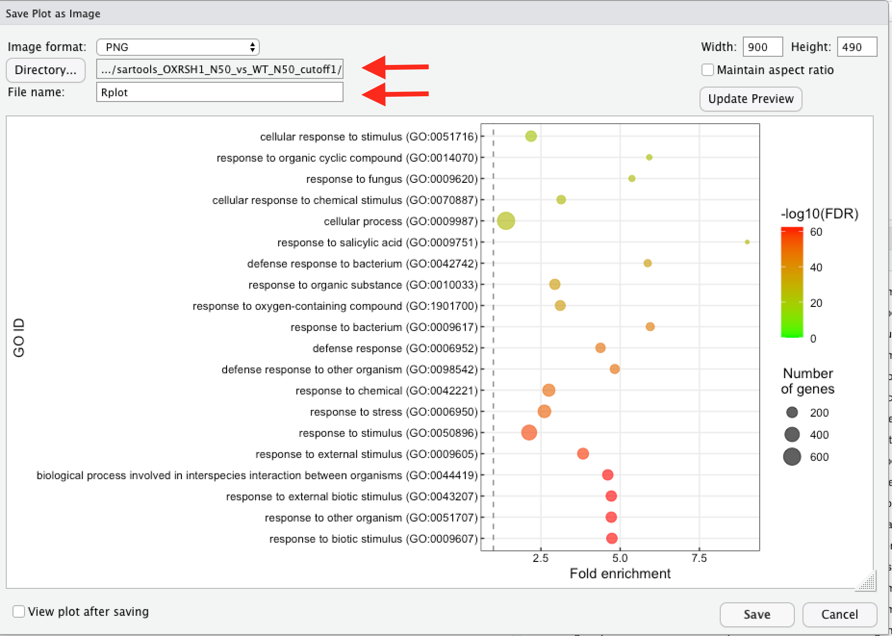

# Mise en forme automatique des données de Gene ontology en vue d'une représentation graphique avec R

# Prérequis pour MacOS

Installer Xcode depuis l'App Store (c'est plutôt long)


Lancer Xcode une fois pour qu'il finisse l'installation. Le mot de passe de l'ordinateur vous sera demandé.

Quitter complètement.


# Prérequis pour Windows

## Installation d’un terminal UNIX

- Enregistrer sur votre PC le fichier [TerminalUnixSetup.exe](https://github.com/cecile-lecampion/gene-ontology-analysis-and-graph/releases/download/1.0.0/TerminalUnixSetup.exe)

    Il s'agit d'un exécutable qui va installer un terminal UNIX dans votre répertoire `HOME`
    
- Exécuter `TerminalUnixSetup.exe` 

    Le terminal UNIX s'installe avec tous les outils nécessaires. Un répertoire `tools` est aussi créé dans votre  `HOME`. Il contient le script `prepare_gene_onthology.pl`

    

## Lancement du terminal

Sélectionnez `Git Bash` dans le menu de Windows ou cliquez sur l'icone présente sur le bureau


  

# Installation de R et R-studio

  ## Sous Windows

- Installation de R

Sur le site du CRAN : https://cran.r-project.org/bin/windows/base/  

Cliquer sur `Download R 4.0.5 for Windows` et suivre les instructions (en cas de nouvelle version le n° peut varier)

- Installation de R-studio

Sur la page : https://www.rstudio.com/products/rstudio/download/#download

Choisissez la version pour Windows 10, suivez les instructions. 

Si votre ordinateur est toujours un system 32 bit il faudra alors prendre une version antérieure de R studio. Sur la page https://www.rstudio.com/products/rstudio/older-versions/ choisir la version `RStudio Desktop 1.1.463`

## Sous MacOS

- Installation de R

Sur le site du CRAN : https://cran.r-project.org/bin/macosx/

Cliquer sur `R-4.0.5.pkg` et suivre les instructions (en cas de nouvelle version le n° peut varier)

- Installation de R-studio

Sur la page : https://www.rstudio.com/products/rstudio/download/#download

Choisissez la version pour macOS, suivez les instructions.

 

# Script de préparation des données

## Installation du fichier sous MacOS

### Préparation

- Sauvegarder le fichier `prepare_gene_onthology.pl` dans `Téléchargement`

- Ouvrez un terminal UNIX : `Terminal` 

    

### Création d’un répertoire `tools` qui va contenir le script

- Lancez les deux commandes suivantes dans le terminal (par copier / coller)

    ```bash
    mkdir -p $HOME/tools
    ```
### Installation du fichier `prepare_gene_onthology.pl` dans le répertoire `tools`

- Exécutez les commandes suivantes pour déplacer le fichier et le rendre exécutable

    ```bash
    mv $HOME/Downloads/prepare_gene_onthology.pl $HOME/tools
    chmod +x $HOME/tools/prepare_gene_onthology.pl
    ```

- Fermez le terminal, l’installation est terminée.

## Installation du fichier sous Windows

Le fichier a été installé par l'executable `TerminalUnixSetup.exe` :smile:

## Première exécution

### Ouvrez un terminal UNIX dans le répertoire où se trouve le fichier à traiter

Ouvrez le `Terminal` et taper `cd` puis un `espace` et faites glisser le répertoire dans le terminal depuis le Finder.

### Lancez le script `prepare_gene_onthology.pl`

Lancer la commande suivante (par copier / coller)

:warning: Dans le terminal sous Windows vous ne pouvez pas utiliser `ctrl+c` ou `ctrl+v`. La commande `ctrl+c` interrompt l'action en cours. Utiliser toujours le clic droit pour accéder au menu contextuel.

Sous MacOS, les commandes `cmd+c` et `cmd+v` fonctionnent. La commande `ctrl+c` interrompt elle aussi l'action en cours.

```bash
$HOME/tools/prepare_gene_onthology.pl
```

Si le message de syntaxe ci-dessous s’affiche,  vous pouvez passer directement à l’étape “Exécutions suivantes”.

```bash
prepare_gene_onthology.pl [--help|--man|--version]

or

prepare_gene_onthology.pl [-m|--method] [-c|--correction] input_gene_list.tsv output_curated_gene_ontology.tsv
```

Si, au contraire, le message suivant apparait, c’est que les modules Perl nécessaires ne sont pas installés:

```
Au moins un des modules Perl nécessaires n'est pas installé.
Pour utiliser ce script vous devez d'abord exécuter les commandes suivantes:

cpan App::cpanminus
cpanm WWW::Mechanize
cpanm JSON
```

Créer ou mettre à jour un fichier`.zshrc`

```bash
touch .zshrc .bashrc
```

Puis exécuter la commande:

```bash
cpan App::cpanminus
```

> Cette commande peut poser quelques questions.
>
> Acceptez toutes les réponses par défaut en tapant sur la touche `Entrée` 

:warning: ​**==Ouvrez un nouvel onglet en tapant==** `cmd+t`

puis exécutez la commande:

```bash
cpanm WWW::Mechanize
```

Exemple d’affichage:


et enfin la commande:

```bash
cpanm JSON
```

## Exécutions suivantes

Le script `prepare_gene_onthology.pl` réalise l'analyse de gene ontology avec PANTHER et REVIGO à partir d'une
liste de gene ID selon le protocole décrit par Bonnot et al, 2019 . Il met en forme le résultat pour que ce dernier soit utilisable par les scripts `script_1plot.R` et `script_2plot.R` pour faire la repésentation graphique de l'analyse d'ontologie.

Il s'utilise de la façon suivante :

```bash
$HOME/tools/prepare_gene_onthology.pl [-m|--method] [-c|--correction] input_gene_list.tsv output_curated_gene_ontology.tsv
```

`[-m|--method] [-c|--correction]` sont les options du script. Elle permettent de définir la méthode pour l'analyse et le type de correction. 

Pour la méthode on a 3 possibilités : 	biological_process 
            	  													cellular_component
            	  													molecular_function

La valeur par défaut est `biological_process`, cela signfie que si vous ne spéfifiez pas de méthode, la méthode  `biological_process` sera appliquée.

Pour la correction on a 2 possibilités :	fdr

​																	   bonferroni

La valeur par défaut est `fdr`.


`input_gene_list.tsv` est le fichier qui contient les données que vous souhaitez analyser que l'on appelera `myfile.tsv`. Vous pouvez lui donner le nom qui vous convient.

L'extention`.tsv` signifie "Tab-separated values". Tout fichiers comportant des colonnes séparés par des tabulations est conforme à ce format, même si son extention est `.txt`. Vous pouvez donc passer en entrée du script un fichier `.txt`.

`output_curated_gene_ontology.tsv` est le fichier de sortie, celui que vous utiliserez pour faire la représentation graphique. Vous pouvez utiliser le nom actuel ou définir un nom de votre choix.

:warning: **==Les noms de fichiers ne doivent contenir ni espace ni caractères accentués.==** 

On pourra alors écrire la commande sous cette forme :

```bash
$HOME/tools/prepare_gene_onthology.pl --method biological_process --correction fdr myfile.tsv my_output_file.tsv
```

On peut aussi utiliser la version courte pour l'appel des options :

```bash
$HOME/tools/prepare_gene_onthology.pl -m biological_process -c fdr myfile.tsv my_output_file.tsv
```

Vous pouvez retrouver ces information en tapant :

```bash
prepare_gene_onthology.pl --man
```

Cette commande affiche le manuel d'utilisation, pour retourner au promt du terminal il faut taper `q`, pour `quit`.

Si on exécute la commande 

```bash
$HOME/tools/prepare_gene_onthology.pl --method biological_process --correction fdr myfile.tsv my_output_file.tsv
```

Le terminal affiche le message suivant :

```bash
Step 1/6 Extract gene ID list from myfile.tsv
Step 2/6 Panther ontology analysis => /tmp/gene_ontology_analysis.txt
request...
export result
Step 3/6 extract GO ids and FDR from /tmp/gene_ontology_analysis.txt
Step 4/6 REVIGO reduction => /tmp/gene_ontology_analysis_revigo.csv
request.................
export result
Step 5/6 Formating my_output_file.tsv : filter panther result with revigo result
Step 6/6 cleanup: remove temporay files from /tmp
```

:warning: L'accès à REVIGO (étape 4/6) peut être long, parfois trop long. Si le script "plante" avec un message du type "request.Error POSTing http://revigo.irb.hr/QueryJobStatus.aspx: read timeout...", relancez simplement la même commande.

# Représentation graphique des résultats

Deux scripts retravaillés sont disponibles, 1 permettant de créer un seul graphique et un permettant de générer deux graphiques qui seront de la même taille et associés en une seule image.

Il existe aussi la possibilité de générer un graph pour comparer plusieurs conditions.

Ouvrir R-studio, ouvrir le script choisi . 


La fenêtre R-studio se divise en 4 cadrans. Le script va apparaitre dans le cadran en haut à gauche.

Au fur et à mesure de l'éxécution les commande apparaissent en bas à gauche et les variables en haut à droite.

A la fin le graph apparait dans le cadran en bas à droite.


Pour exécuter les commandes il suffit de se placer sur la ligne à exécuter et de cliquer sur  `Run`


Les étapes des scripts sont décrites ici mais vous n'avez besoin que des fichiers `.R` que vous ouvrez dans R-studio pour faire le graph.

### 1 graph : script_1plot.R

Si nécessaire il faut installer le package `ggplot2`

```R
if (!requireNamespace("ggplot2", quietly = TRUE))
    install.packages("ggplot2")
```

Charger la librairie et choisir le répertoire de travail

```R
# Load the ggplot2 package
library(ggplot2)
```

Vous pouvez choisir le répertoire de travail de façon graphique en parcourant l'arborescence dans le cadre en bas à droite puis en cliquant sur `More -> Set As Working Directory `


```R
# set the working directory where the tables to use are located
setwd("PATH/TO/data")
```

Importation des données 

```R
GO_all <- read.table("output_curated_gene_ontology.tsv",header=T,stringsAsFactors = T)		
```

SI on souhaite utiliser seulement un sous ensemble des identifiants GO, par exemple les 20 plus significatifs (le fichier est trié en fonction des FDR croissants), exécuter cette commande :

```R
GO_all <- GO_all[1:20,]		#crée un nouveau tableau de données avec les lignes 1 à 20 de GO_all et toutes les colonnes
```

Sinon passer à la suite

```R
# List objects and their structure contained in the dataframe 'GO_all'
ls.str(GO_all)

# Transform the column 'Gene_number' into a numeric variable
GO_all$Gene_number <- as.numeric(GO_all$Gene_number)

# Replace all the "_" by a space in the column containing the GO terms
GO_all$GO_id <- chartr("_", " ", GO_all$GO_id)

# Transform FDR values by -log10('FDR values')
GO_all$'|log10(FDR)|' <- -(log10(GO_all$FDR))
```

Déssiner le graph

```R
# Draw the plot with ggplot2 (Figure 2)
#--------------------------------------
ggplot(GO_all, aes(x = GO_id, y = Fold_enrichment)) +
  geom_hline(yintercept = 1, linetype="dashed", 
             color = "azure4", size=.5)+
  geom_point(data=GO_all, aes(x=GO_id, y=Fold_enrichment, size = Gene_number, colour = `|log10(FDR)|`), alpha=.7)+
  #scale_y_continuous(limits = c(0,15))+	# Retirer le # si on veut fixer l'échelle sur l'axe x (ici entre 0 et 15)
  scale_x_discrete(limits= GO_all$GO_id)+
  scale_color_gradient(low="green", high="red", limits=c(0, NA))+
  coord_flip()+
  theme_bw()+
  theme(axis.ticks.length=unit(-0.1, "cm"),
        axis.text.x = element_text(margin=margin(5,5,0,5,"pt")),
        axis.text.y = element_text(margin=margin(5,5,5,5,"pt")),	# pour modifier la taille des étiquettes : axis.text.y = element_text(margin=margin(5,5,5,5,"pt"), size = 14)
        axis.text = element_text(color = "black"),
        panel.grid.minor = element_blank(),
        legend.title.align=0.5)+
  xlab("GO ID")+	# c'est le nom qui apparit sur le coté gauche du graph
  ylab("Fold enrichment")+
  labs(color="-log10(FDR)", size="Number\nof genes")+ #Replace by your variable names; \n allow a new line for text
  guides(size = guide_legend(order=2),
         colour = guide_colourbar(order=1))
```


### 2 graphs en une seule figure : script_2plot.R

Par exemple un pour les up et un pour les down

Si nécessaire il faut installer le package `ggplot2` et le package `cowplot`

```R
if (!requireNamespace("ggplot2", quietly = TRUE))
    install.packages("ggplot2")
if (!requireNamespace("cowplot", quietly = TRUE))
    install.packages("cowplot")
if (!requireNamespace("devtools", quietly = TRUE))
    install.packages("devtools")
```

Charger la librairie et choisir le répertoire de travail

```R
# Load the ggplot2 package
library(ggplot2)
library(cowplot)

# set the working directory where the tables to use are located
setwd("PATH/TO/data")
```

Importation des données : dans ce cas on dispose de deux fichiers up.txt et down.txt

```R
GO_up <- read.table("output_curated_gene_ontology_up.tsv",header=T,stringsAsFactors = T)		
GO_down <- read.table("output_curated_gene_ontology_down.tsv",header=T,stringsAsFactors = T)	
```

SI on souhaite utiliser seulement un sous ensemble des identifiants GO, par exemple les 20 plus significatifs (le fichier est trié en fonction des FDR croissants), exécuter cette commande :

```R
GO_up <- GO_up[1:20,]		#crée un nouveau tableau de données avec les lignes 1 à 20 de GO_up et toutes les colonnes
GO_down <- GO_down[1:20,]		#crée un nouveau tableau de données avec les lignes 1 à 20 de GO_down et toutes les colonnes
```

Sinon passer à la suite en traitant séparément les deux jeux de données.

- Pour les Up

```R
# List objects and their structure contained in the dataframe 'GO_all'
ls.str(GO_up)

# Transform the column 'Gene_number' into a numeric variable
GO_up$Gene_number <- as.numeric(GO_up$Gene_number)

# Replace all the "_" by a space in the column containing the GO terms
GO_up$GO_id <- chartr("_", " ", GO_up$GO_id)

# Transform FDR values by -log10('FDR values')
GO_up$'|log10(FDR)|' <- -(log10(GO_up$FDR))

```

Générer le graph sans l'afficher

```R
up <- ggplot(GO_up, aes(x = GO_id, y = Fold_enrichment)) +
  geom_hline(yintercept = 1, linetype="dashed", 
             color = "azure4", size=.5)+
  geom_point(data=GO_up, aes(x=GO_id, y=Fold_enrichment, size = Gene_number, colour = `|log10(FDR)|`), alpha=.7)+
  scale_y_continuous(limits = c(0,15))+
  scale_x_discrete(limits= GO_up$GO_id)+
  scale_color_gradient(low="green", high="red", limits=c(0, NA))+
  coord_flip()+
  theme_bw()+
  theme(axis.ticks.length=unit(-0.1, "cm"),
        axis.text.x = element_text(margin=margin(5,5,0,5,"pt")),
        axis.text.y = element_text(margin=margin(5,5,5,5,"pt"), size = 14),
        axis.text = element_text(color = "black"),
        panel.grid.minor = element_blank(),
        legend.title.align=0.5)+
  xlab("GO ID")+	# c'est le nom qui apparit sur le coté gauche du graph
  ylab("Fold enrichment")+
  ggtitle("UP")+
  labs(color="-log10(FDR)", size="Number\nof genes")+ #Replace by your variable names; \n allow a new line for text
  guides(size = guide_legend(order=2),
         colour = guide_colourbar(order=1))
```

- Pour les Down

```R
# List objects and their structure contained in the dataframe 'GO_all'
ls.str(GO_down)

# Transform the column 'Gene_number' into a numeric variable
GO_down$Gene_number <- as.numeric(GO_down$Gene_number)

# Replace all the "_" by a space in the column containing the GO terms
GO_down$GO_biological_process <- chartr("_", " ", GO_down$GO_biological_process)

# Transform FDR values by -log10('FDR values')
GO_down$'|log10(FDR)|' <- -(log10(GO_down$FDR))
```

Générer le graph sans l'afficher

```R
down <- ggplot(GO_down, aes(x = GO_id, y = Fold_enrichment)) +
  geom_hline(yintercept = 1, linetype="dashed", 
             color = "azure4", size=.5)+
  geom_point(data=GO_down, aes(x=GO_id, y=Fold_enrichment, size = Gene_number, colour = `|log10(FDR)|`), alpha=.7)+
  scale_y_continuous(limits = c(0,15))+
  scale_x_discrete(limits= GO_down$GO_id)+
  scale_color_gradient(low="green", high="red", limits=c(0, NA))+
  coord_flip()+
  theme_bw()+
  theme(axis.ticks.length=unit(-0.1, "cm"),
        axis.text.x = element_text(margin=margin(5,5,0,5,"pt")),
        axis.text.y = element_text(margin=margin(5,5,5,5,"pt"), size = 14),
        axis.text = element_text(color = "black"),
        panel.grid.minor = element_blank(),
        legend.title.align=0.5)+
  xlab("GO ID")+	# c'est le nom qui apparit sur le coté gauche du graph
  ylab("Fold enrichment")+
  ggtitle("DOWN")+
  labs(color="-log10(FDR)", size="Number\nof genes")+ #Replace by your variable names; \n allow a new line for text
  guides(size = guide_legend(order=2),
         colour = guide_colourbar(order=1))
```

- Combiner les deux graph en une seule figure

    les deux graphs ont les mêmes dimensions indépendement des étiquettes de données.

```R
cowplot::plot_grid(up, down, ncol = 1, align = "v")
```

### Session R

La commande suivant pemet d'afficher toutes les informations concernant la session R qui a produit les données : outils, version ...

```R
InfoSession <- devtools::session_info()

# save session file
 write.table(InfoSession, file = "InfoSession.txt", 
                quote = FALSE, row.names = FALSE, sep = '\t')
```


### Sauvegarder les graphiques produits

Le graphique s'affiche dans le cadran en bas à droite


L'image peut ne pas avoir l'aspect souhaité, c'est du à l'espace disponible dans le cadran de visualisation, cela se corrige lors de l'export.

Cliquer sur `export `puis `Save as Image` pour sauver votre graphique. Une boite de dialogue s'ouvre.

Vous pouvez modifier les paramètre de longueur et largeur puis en utilisant `Update Preview` voir le résultat


Si le résultat vous convient, choisissez le répertoire et le nom du fichier puis cliquez sur `Save`



## Citations

PANTHER

>  PANTHER version 16: a revised family classification, tree-based classification tool, enhancer regions and extensive API
> Huaiyu Mi, Dustin Ebert, Anushya Muruganujan, Caitlin Mills, Laurent-Philippe Albou, Tremayne Mushayamaha and Paul D Thomas . *Nucl. Acids Res. (2020) doi: 10.1093/nar/gkaa1106s.*

REVIGO

> Supek F, Bošnjak M, Škunca N, Šmuc T. "*REVIGO summarizes and visualizes long lists of Gene Ontology terms"* 
> PLoS ONE 2011. [doi:10.1371/journal.pone.0021800](http://dx.doi.org/10.1371/journal.pone.0021800)

Script R

> A Simple Protocol for Informative Visualization of Enriched Gene Ontology Terms. T. Bonnot, MB. Gillard and DH. Nagel. Bio-101: e3429. DOI:10.21769/BioProtoc.3429

R Packages

> R Core Team. 2020. *R: A Language and Environment for Statistical Computing*. Vienna, Austria: R Foundation for Statistical Computing. https://www.R-project.org/.

> Wickham, Hadley. 2016. *Ggplot2: Elegant Graphics for Data Analysis*. Springer-Verlag New York. https://ggplot2.tidyverse.org.

> Wickham, Hadley, Jim Hester, and Winston Chang. 2021. *Devtools: Tools to Make Developing r Packages Easier*. https://CRAN.R-project.org/package=devtools.

> Wilke, Claus O. 2020. *Cowplot: Streamlined Plot Theme and Plot Annotations for ’Ggplot2’*. https://CRAN.R-project.org/package=cowplot.

Script `prepare_gene_onthology.pl`

> Terese M. et Lecampion C. https://github.com/cecile-lecampion/gene-ontology-analysis-and-graph

